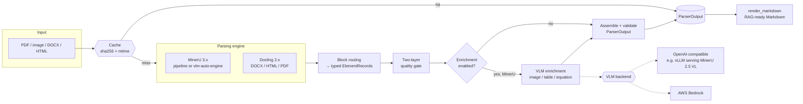

# hybrid-doc-parser

**MinerU 3.x + per-element VLM enrichment — a hybrid document parser that turns
PDFs, scans, and office documents into clean, structured, RAG-ready output.**

`hybrid-doc-parser` runs a fast layout/OCR engine (MinerU, or optionally Docling)
to extract every block of a document, then **selectively** calls a vision-language
model (VLM) only where it adds value — describing figures, summarising tables, and
explaining equations, or re-reading pages the OCR layer handled poorly. The result
is a single validated `ParserOutput` you can serialise, cache, and render to
Markdown.

---

## Why this design

Pure OCR is cheap but loses meaning (a chart becomes nothing; a table becomes
noise). Pure VLM-on-every-page is accurate but slow and expensive. This library is
**hybrid**: it uses the cheap engine for the bulk of the work and spends VLM calls
only where a quality gate or an element type justifies it.

- **Engine first** — MinerU extracts typed blocks (text, headings, tables, images,
  equations) with bounding boxes.
- **Quality gate decides** — a two-layer gate flags pages the engine read poorly
  and promotes them for VLM review.
- **VLM enriches selectively** — figures/tables/equations get a plain-language
  description; everything else stays as extracted text.
- **Never raises** — every failure becomes a `WarningRecord` inside a valid
  `ParserOutput`. Callers always get a structured result.
- **Cached** — results are keyed on file SHA-256 + mtime; an unchanged file is
  returned instantly without re-running any engine.

---

## Architecture at a glance



A detailed, line-level flow (every branch, warning code, and threshold) lives in
**[docs/LOGIC_FLOW.md](docs/LOGIC_FLOW.md)** and **[docs/parse-pipeline.md](docs/parse-pipeline.md)**.

---

## Installation

Requires **Python ≥ 3.12**. The project uses [`uv`](https://github.com/astral-sh/uv).

```bash
# core (MinerU pipeline backend)
uv pip install -e .

# with the Docling backend (DOCX / HTML / alternative PDF parsing)
uv pip install -e ".[docling]"

# with dev tooling (tests, lint, fixture generators)
uv pip install -e ".[dev]"

# with the standalone advisory verifier (boto3 + openai; see docs/verifier.md)
uv pip install -e ".[verifier]"
```

> **GPU note:** MinerU and the VLM backend run best on a GPU. To force CPU on an
> incompatible machine, set `CUDA_VISIBLE_DEVICES=""`. See the package inventory in
> [docs/PACKAGES.md](docs/PACKAGES.md).

---

## Quickstart

```python
from pathlib import Path
from hybrid_doc_parser import parse, render_markdown, EnrichmentConfig

# 1. Plain structured extraction (no VLM calls)
output = parse(Path("report.pdf"))
print(output.page_count, "pages,", len(output.elements), "elements")

# 2. Render to clean Markdown for RAG ingestion
md = render_markdown(output)
Path("report.md").write_text(md)

# 3. With VLM enrichment (describe figures, summarise tables, explain equations)
config = EnrichmentConfig(enabled=True)          # needs VLM env vars (see below)
enriched = parse(Path("report.pdf"), config)
```

### Batch parsing

```python
import asyncio
from pathlib import Path
from hybrid_doc_parser import parse_batch, EnrichmentConfig

paths = [Path(p) for p in ("a.pdf", "b.pdf", "c.pdf")]
results = asyncio.run(parse_batch(paths, EnrichmentConfig(), max_concurrency=4))
# results are returned in input order, one ParserOutput per input
```

For the MinerU backend, `parse_batch` groups uncached files into chunks of
`MINERU_BATCH_SIZE` (default 8) and runs **one** inference call per chunk —
`ceil(N / batch_size)` inference windows instead of `N`. Cache hits and invalid
paths skip inference entirely; a chunk that fails falls back to per-file `parse()`
for that chunk only. See [docs/LOGIC_FLOW.md](docs/LOGIC_FLOW.md#batch-flow).

---

## Public API

The package exports a small, stable surface (`hybrid_doc_parser.__init__`):

| Symbol | Kind | Purpose |
|---|---|---|
| `parse(file_path, config=None)` | function | Parse one document → `ParserOutput`. Never raises. |
| `parse_batch(paths, config=None, max_concurrency=4)` | async function | Parse many documents, in input order, with chunked MinerU batch inference. |
| `render_markdown(output)` | function | Render a `ParserOutput` to RAG-ready Markdown. |
| `verify(parser_output, file_path, config)` | function | **(Experimental)** Advisory second-opinion verifier run AFTER `parse()`. Never raises. See [docs/verifier.md](docs/verifier.md). |
| `EnrichmentConfig` | model | Backend + enrichment configuration. |
| `VerifierConfig`, `VerificationReport` | models | **(Experimental)** Verifier config + advisory report (top-level `verification` envelope). See [docs/verifier.md](docs/verifier.md). |
| `ParserOutput` | model | Full structured result. |
| `ElementRecord`, `PageRecord`, `WarningRecord`, `ElementType` | models | Components of the output schema. |

---

## Configuration

### `EnrichmentConfig` (per-call)

| Field | Default | Meaning |
|---|---|---|
| `enabled` | `False` | Master switch for VLM enrichment. |
| `image` / `table` / `equation` | `True` | Which element types to enrich (when enabled). |
| `context_window` | `3` | Surrounding blocks included in the VLM prompt (0–20). |
| `max_context_tokens` | `512` | Approx. token cap for context text (64–4096). |
| `vlm_backend` | `"openai_compatible"` | `"openai_compatible"` or `"bedrock"`. |
| `parser` | `"mineru"` | `"mineru"`, `"docling"`, or `"auto"` (per-file selection). |
| `do_ocr` | `True` | Docling only: enable OCR. |
| `table_mode` | `"fast"` | Docling only: TableFormer mode (`"fast"`/`"accurate"`). |
| `do_table_structure` | `True` | Docling only: run table-structure recognition. |
| `docling_artifacts_path` | `None` | Docling only: custom model-weights path. |

> Enrichment currently runs on the **MinerU** path only. With `parser="docling"`
> and `enabled=True`, a `enrichment_not_supported` warning is emitted instead.

### Environment variables

| Variable | Default | Purpose |
|---|---|---|
| `MINERU_BACKEND` | `pipeline` | MinerU backend: `pipeline` or `vlm-auto-engine`. |
| `MINERU_BATCH_SIZE` | `8` | Files per MinerU batch-inference chunk (`parse_batch`). |
| `MINERU_MAX_INFLIGHT` | `1` | Concurrent MinerU inference calls (multi-GPU hosts). |
| `PARSER_RENDER_DPI` | `144` | DPI for page/region rasterisation. |
| `PARSER_MAX_RENDER_MP` | `40.0` | Max megapixels per rendered page. |
| `HYBRID_DOC_PARSER_CACHE_DIR` | `~/.cache/hybrid_doc_parser` | Cache directory. |
| `OPENAI_BASE_URL` | — | Base URL for the OpenAI-compatible VLM. |
| `OPENAI_API_KEY` | — | API key (use `none` for auth-less local servers). |
| `VLM_MODEL_NAME` | — | Model name for the OpenAI-compatible VLM. |
| `AWS_REGION` | `ap-southeast-2` | AWS region for Bedrock. |
| `BEDROCK_VLM_MODEL` | — | Bedrock model ID. |
| `CUDA_VISIBLE_DEVICES` | (unset) | Set `""` to force CPU. |

Copy [.env.example](.env.example) to `.env` and fill in the VLM settings.

### VLM backend / self-hosting

The VLM is reached through an OpenAI-compatible API or AWS Bedrock. To self-host
**MinerU 2.5 VL** (the document-specialised vision-language model) behind the
OpenAI-compatible endpoint, serve it with **vLLM** and point `OPENAI_BASE_URL` at
it. The rationale (cost, privacy, control) is documented in
[docs/SELF_HOSTING_JUSTIFICATION.md](docs/SELF_HOSTING_JUSTIFICATION.md).

---

## Advisory verifier (experimental)

> **STATUS: DESIGN / EXPERIMENTAL — NOT YET RECOMMENDED FOR PRODUCTION USE.**
> The design and implementation are complete, but the feature is not recommended
> for production until a real-model precision/recall measurement passes the eval
> gate. The current gate artifact validates only the eval *harness* against a
> deterministic fake backend, not a real model.

`verify(parser_output, file_path, config)` is a **standalone, advisory
second-opinion** step the caller runs **AFTER** `parse()`. It renders the source
page image and asks a VLM to flag high-confidence disagreements (plus missing and
extra elements) against MinerU's extraction, returning a `VerificationReport`.

It is deliberately separate from `parse()`: it is never called from inside
`parse()`/`parse_batch()`, never mutates the parse output, has its own optional
`verifier` extra (lazy `boto3`/`openai` imports) and its own verification cache —
so `parse()`'s local / deterministic / never-network / never-raises / cacheable
invariants are fully preserved. PDF and image inputs only; DOCX/HTML no-op with a
`verification_unsupported` warning.

```python
from pathlib import Path
from hybrid_doc_parser import parse, verify, VerifierConfig

output = parse(Path("scan.pdf"))                       # local, deterministic, cacheable
report = verify(                                       # edge-only second opinion
    output, Path("scan.pdf"),
    VerifierConfig(enabled=True, backend="bedrock",
                   model="anthropic.claude-3-5-sonnet-20241022-v2:0",
                   region="ap-southeast-2"),
)
```

Full contract, `VerifierConfig` fields, the `verification` report envelope, the
optional extra, the separate cache, limitations, known issues, and the eval gate
are documented in **[docs/verifier.md](docs/verifier.md)**.

---

## Output schema

```
ParserOutput
├── schema_version: "1.0"
├── file_path, file_sha256, page_count
├── pages:    list[PageRecord]      # per-page quality decision + vlm_used
├── elements: list[ElementRecord]   # typed blocks, in page order
├── warnings: list[WarningRecord]   # non-fatal diagnostics (empty = clean parse)
└── enrichment_config: EnrichmentConfig
```

All models are **frozen** (immutable) Pydantic v2. `ElementRecord.image_bytes`
round-trips as base64. Full field-by-field reference and warning-code table:
[docs/parse-pipeline.md](docs/parse-pipeline.md).

---

## Repository layout

| Path | What it is |
|---|---|
| `src/hybrid_doc_parser/parser.py` | Orchestration: `parse`, `parse_batch`, engine dispatch, routing, batching. |
| `src/hybrid_doc_parser/models.py` | Pydantic output schema + `EnrichmentConfig`. |
| `src/hybrid_doc_parser/quality_gate.py` | Two-layer quality gate (coverage + heuristics). |
| `src/hybrid_doc_parser/modal_processors.py` | Per-type VLM enrichment (image/table/equation). |
| `src/hybrid_doc_parser/vlm_client.py` | VLM backends (OpenAI-compatible, Bedrock) + robust JSON parsing. |
| `src/hybrid_doc_parser/context.py` | Surrounding-context extraction for enrichment prompts. |
| `src/hybrid_doc_parser/render.py` | PDF rasterisation + text-layer token counting (pypdfium2). |
| `src/hybrid_doc_parser/cache.py` | File-keyed `ParserOutput` cache (atomic writes). |
| `src/hybrid_doc_parser/markdown.py` | `render_markdown` — RAG-ready Markdown rendering. |
| `src/hybrid_doc_parser/verifier.py` | **(Experimental)** Standalone advisory `verify()` + `VerifierClient` backends. |
| `src/hybrid_doc_parser/verifier_cache.py` | **(Experimental)** Separate file-based verification cache. |
| `scripts/` | Benchmarking (`bench_docbench.py`), prediction generation, real-batch smoke test. |
| `tests/` | Unit + integration tests. |
| `docs/` | Architecture, pipeline, packages, benchmarks, self-hosting, verifier. |

---

## Development

```bash
uv pip install -e ".[dev]"
pytest                      # run the test suite
pytest -m "not slow"        # skip end-to-end MinerU tests
ruff check src tests        # lint
black src tests             # format
pre-commit install          # enable git hooks
```

Test markers: `live` (needs real VLM credentials), `slow` (full MinerU
end-to-end), `asyncio`. Coverage gate is 80% (`pyproject.toml`).

---

## Key invariant

> `parse()` **never raises.** Every failure path — missing file, unsupported type,
> engine crash, enrichment error — returns a valid `ParserOutput` whose `warnings`
> list explains what went wrong. `parse_batch()` upholds this per document: one
> bad file never aborts the batch.
