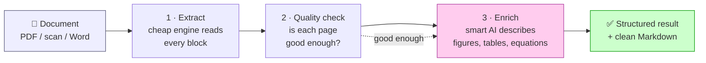
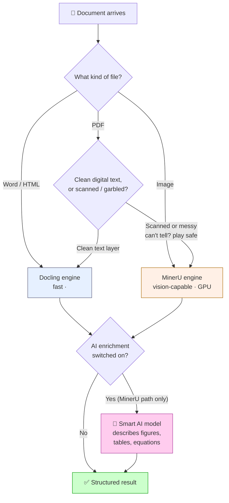
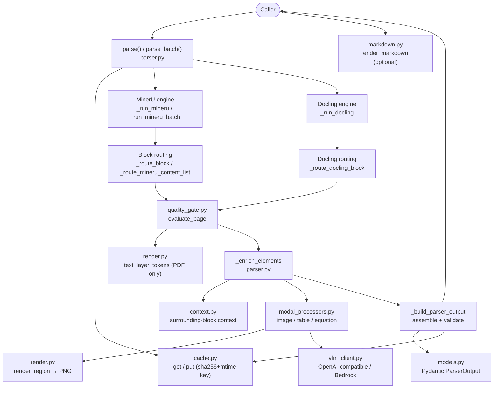
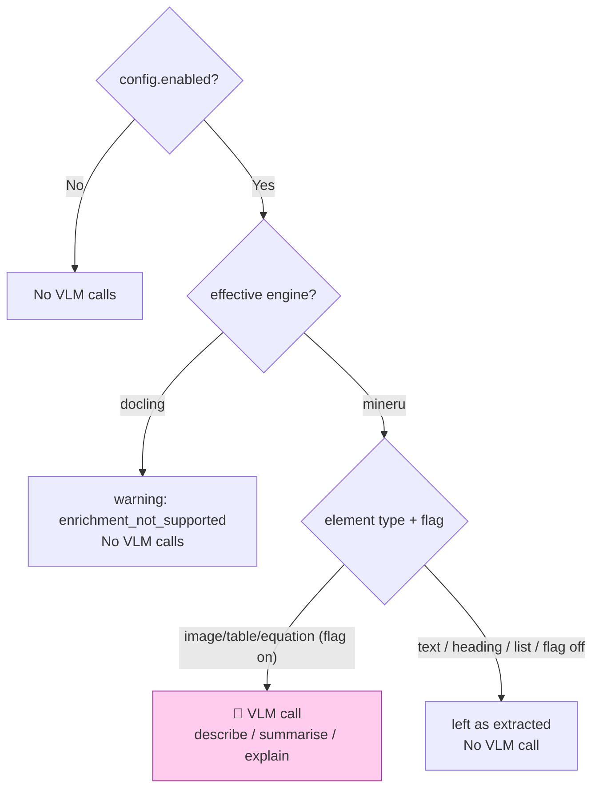
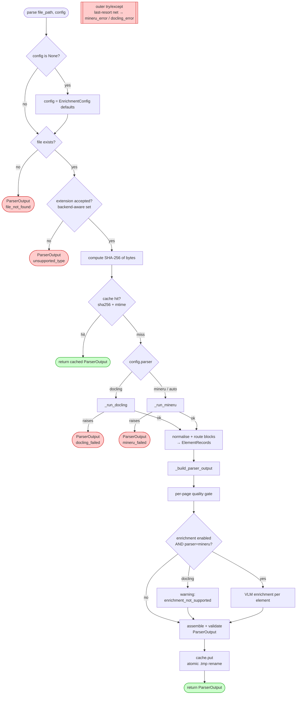
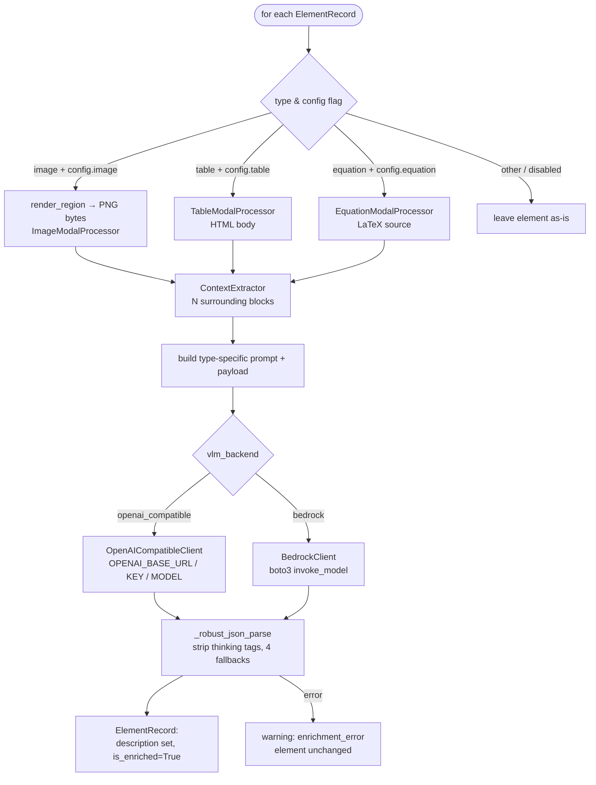
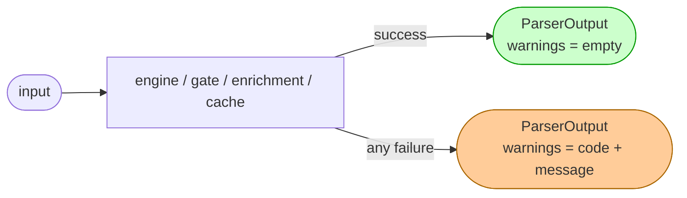

# Logic Flow — hybrid-doc-parser

> **Read this first:** Part A is a plain-language overview of the design — what the
> system does and why, suitable for discussion with anyone. Part B is the
> technical control-flow reference for engineers working in the code.

---

# Part A — The big picture (non-technical)

## What it does, in one sentence

It takes a document (a PDF, a scan, a Word file) and turns it into clean,
structured data that downstream systems — search, RAG, analytics — can actually
use.

## The core idea: do the cheap thing first, the expensive thing only when needed

There are two ways to read a document with a machine:

- **A fast, cheap engine** (OCR + layout detection) — great at plain text, but it
  loses meaning. A chart becomes nothing; a messy table becomes noise.
- **A smart, expensive AI model** (a vision-language model, "VLM") — understands
  figures, tables, and equations like a person would, but it's slow and costs
  money on every page.

Running the smart model on *every* page would be accurate but far too slow and
expensive. Running only the cheap engine would be fast but low quality.

**This system is a hybrid.** It runs the cheap engine on everything, then the
smart model is called **only where it adds the most value** — on figures, tables,
and equations. A "quality check" in between also flags pages the cheap engine read
poorly, so nothing slips through unnoticed. You get most of the accuracy of the
expensive approach at a fraction of the cost.

There are actually **two** cheap engines, picked per document:

- **Docling** — fast and CPU-only; best for clean digital PDFs and Office/HTML
  files where the text is already machine-readable.
- **MinerU** — vision-capable (heavier, GPU); best for scanned or messy PDFs and
  images, where the text has to be *read off the page*.

## The four stages, in plain terms



1. **Extract** — the engine pulls out every block of the document (paragraphs,
   headings, tables, images, equations) and remembers where each one sits.
2. **Quality check** — a two-step gate looks at each page and asks "did we read
   this well, or is it garbled?" Pages that look poorly read get flagged.
3. **Enrich (optional)** — the smart AI model describes figures, summarises tables,
   and explains equations in plain language. (The quality check from step 2 also
   records which pages the engine likely read poorly, so they can be reviewed.)
4. **Deliver** — everything is packaged into one consistent result, saved, and can
   be rendered to clean Markdown for search or RAG.

## Which engine handles a document — and when the AI is used

This is the routing the system follows. By default it decides automatically, but a
caller can also force a specific engine.



**Reading the diagram in plain terms:**

- **When is Docling chosen?** For Word and HTML files, and for **clean digital
  PDFs** whose text is already machine-readable. It's the cheap, fast path.
- **When is it escalated to MinerU?** For **images**, and for **PDFs that look
  scanned or garbled** — the text has to be recognised visually, which only MinerU
  can do. If the system genuinely can't tell, it plays safe and uses MinerU so no
  content is lost.
- **When is the AI (VLM) used?** Only when enrichment is switched on, and only on
  the **MinerU path** — to describe figures, summarise tables, and explain
  equations. Plain text is never sent to the AI; that would just add cost.

> Note: the quality check flags poorly-read pages as "needs review," but in the
> current version that flag is **recorded as a signal** — the actual AI calls are
> the figure/table/equation enrichment above. (See Part B for the exact code path.)

## Three design choices worth knowing

- **It never crashes the caller.** If anything goes wrong — a missing file, a
  broken page, the AI model being unreachable — the system still returns a valid
  result with a note explaining what failed. Downstream code never has to handle a
  crash.
- **It remembers what it has seen.** Each document is fingerprinted; if the same
  unchanged file is parsed again, the saved result is returned instantly with no
  reprocessing. Re-runs are cheap.
- **It can process documents in bulk efficiently.** When handling many files, it
  groups them so the expensive engine runs once per *batch* instead of once per
  *file* — a big speed-up at volume. One bad file never spoils the batch.

## Where the AI model comes from

The "smart model" is reached over a standard API. You can use a hosted provider,
or **self-host the document-specialised model (MinerU 2.5 VL) on your own GPU**
(served with vLLM) for lower cost and full data privacy — see
[SELF_HOSTING_JUSTIFICATION.md](SELF_HOSTING_JUSTIFICATION.md). Either way, the
rest of the system is unchanged.

---

# Part B — The technical flow (for engineers)

This part explains **how the code thinks**: the control flow through the library,
from a single `parse()` call to batch inference, the quality gate, and VLM
enrichment. It complements [parse-pipeline.md](parse-pipeline.md) (the exhaustive
per-branch reference) by focusing on the *decision logic* and the *module
relationships*.

- **Entry points:** `parse()` and `parse_batch()` in
  [`parser.py`](../src/hybrid_doc_parser/parser.py)
- **Core invariant:** neither entry point raises — failures become
  `WarningRecord`s inside a valid `ParserOutput`.

---

## 1. Module map — who calls whom



---

## 2. Backend selection & escalation — Docling vs MinerU vs VLM

Three independent decisions, made at different points. Keeping them separate is the
key to reading the flow correctly.

### 2.1 Engine selection (`config.parser`) — resolved *before* dispatch

`EnrichmentConfig.parser` chooses the extraction engine. With `"auto"`, the choice
is made **per file**: PDFs are classified by MinerU's `classify()` heuristic;
non-PDFs route by extension.

```mermaid
flowchart TD
    A([parse / parse_batch]) --> B{config.parser}
    B -- "\"mineru\"" --> M[MinerU<br/>_run_mineru]
    B -- "\"docling\"" --> D[Docling<br/>_run_docling]
    B -- "\"auto\"" --> AUTO{file type?}

    AUTO -- "image (.png/.jpg/...)" --> M
    AUTO -- "DOCX / HTML" --> D
    AUTO -- ".pdf" --> CL["classify(pdf_bytes)<br/>mineru.utils.pdf_classify"]

    CL -- "\"ocr\" — scanned / garbled" --> M
    CL -- "\"txt\" — clean text layer" --> D
    CL -. "classify() raises" .-> FB[log warning<br/>fall back to MinerU]
    FB --> M

    style M fill:#fff0e6,stroke:#a60
    style D fill:#e6f0ff,stroke:#557
```

| Input | `parser="mineru"` | `parser="docling"` | `parser="auto"` |
|---|---|---|---|
| Clean text PDF | MinerU | Docling | **Docling** (`classify → txt`) |
| Scanned / garbled PDF | MinerU | Docling | **MinerU** (`classify → ocr`) |
| Image (PNG/JPEG/…) | MinerU | *unsupported* | **MinerU** |
| DOCX / HTML | *unsupported* | Docling | **Docling** |

> **"Escalated to MinerU" means:** in `auto` mode, a PDF that `classify()` judges
> scanned/garbled (`"ocr"`) — or any PDF where `classify()` itself fails — is routed
> to the vision-capable MinerU engine instead of Docling. Images always go to
> MinerU. The fallback direction is always *toward* MinerU, so content is never
> silently dropped. Full heuristic + code location: [pdf-routing.md](pdf-routing.md).

### 2.2 Quality gate (`evaluate_page`) — a per-page *signal*, not a VLM trigger

After extraction, every page is scored and labelled `keep` or `promote_to_vlm`.
**Important:** in v1 this label is recorded (as `PageRecord.vlm_used` + a
`quality_gate_escalation` warning) but does **not** itself launch a VLM call. It is
a diagnostic/recommendation signal. Details in §4.

### 2.3 VLM enrichment — the *only* place the VLM is actually called

The VLM is invoked **only** when **all** of these hold:

1. `config.enabled == True`, **and**
2. the effective engine is **MinerU** (`config.parser != "docling"`; with `auto`,
   the file resolved to MinerU), **and**
3. the element is an **image / table / equation** and its per-type flag
   (`config.image` / `table` / `equation`) is on.



So: **Docling never calls the VLM** (enrichment unsupported in v1), and even on the
MinerU path the VLM only touches modal elements — plain text is never sent.

---

## 3. Single-document flow — `parse()`

The happy path and every guard, in order. Each red terminal is a valid
`ParserOutput` carrying a warning — **not** an exception.



**Why two layers of try/except:** the engine-specific blocks preserve the precise
codes (`mineru_failed` / `docling_failed`); the outer block is a last-resort net
that guarantees the never-raise contract for anything unforeseen
(`mineru_error` / `docling_error`).

---

## 4. Quality gate logic — `evaluate_page()`

The gate decides, per page, whether the cheap engine output is good enough
(`keep`) or should be flagged for VLM review (`promote_to_vlm`). Two layers,
short-circuit on the first failure.

> **This is a signal, not an action (v1).** `promote_to_vlm` is recorded as
> `PageRecord.vlm_used=True` plus a `quality_gate_escalation` warning, but it does
> **not** itself launch a VLM call. Actual VLM calls happen only in enrichment
> (§5), gated by `config.enabled` + MinerU engine + element type. See §2.2.


| Layer | Signal | Threshold | Catches |
|---|---|---|---|
| 1 | Coverage ratio | < 30% (PDF only, ≥ 50 text-layer tokens) | Engine missed most of the embedded text |
| 2 | Garbled token ratio | > 20% | Mixed letter+digit junk (`a1b`) |
| 2 | Mean word length | < 2.0 chars | OCR noise / fragments |
| 2 | Dictionary hit rate | < 50% | Few real words/numbers |
| 2 | Repeated char run | ≥ 7 | OCR smearing (`aaaaaaa`) |
| 2 | ASCII printable ratio | < 90% | Control/garbage characters |

Layer 1 is **PDF-only** (needs an embedded text layer; pypdfium2 counts tokens via
[`render.py`](../src/hybrid_doc_parser/render.py)). DOCX/HTML skip it. Layer 2 runs
for all input types. A blank page is a clean `keep`, never an escalation.

---

## 5. VLM enrichment logic — `_enrich_elements()`

Runs only when `config.enabled=True` **and** `config.parser="mineru"`. Each target
element is enriched independently; an error on one element is captured as a warning
and does not stop the others.



The VLM backend is selected by `make_vlm_client(config)` in
[`vlm_client.py`](../src/hybrid_doc_parser/vlm_client.py). To self-host the model
(MinerU 2.5 VL via vLLM), use `openai_compatible` and point `OPENAI_BASE_URL` at
the vLLM server — see
[SELF_HOSTING_JUSTIFICATION.md](SELF_HOSTING_JUSTIFICATION.md).

---

## 6. Batch flow — `parse_batch()`

The batch path exists to cut MinerU inference windows from `N` (one per file) to
`ceil(N / MINERU_BATCH_SIZE)` (one per chunk). This is the focus of the
`batch_process` work.


Key properties:

- **Cache hits and invalid paths never reach inference** — they are resolved in
  STEP 1 and merged back at the end.
- **Per-chunk isolation** — if one chunk's `do_parse` raises, only that chunk
  falls back to per-file `parse()`; other chunks are unaffected.
- **Concurrency knobs are separate:** `max_concurrency` governs the per-file
  fallback and the non-MinerU path; `MINERU_BATCH_SIZE` controls chunk size and
  `MINERU_MAX_INFLIGHT` bounds concurrent MinerU inference calls (multi-GPU). All
  blocking work (sha256, inference, token counting, enrichment) is offloaded with
  `asyncio.to_thread` so the event loop never stalls.
- **Output order always equals input order**, one `ParserOutput` per input path.

---

## 7. The never-raise contract, visualised

Every box that can fail funnels into a warning, never an exception:



Warning codes (full table in [parse-pipeline.md](parse-pipeline.md#warning-codes)):
`file_not_found`, `unsupported_type`, `mineru_failed`, `mineru_error`,
`docling_failed`, `docling_error`, `enrichment_error`, `enrichment_not_supported`,
`quality_gate_escalation`, `image_too_large`, `cache_write_error`, `render_failed`.

---

## See also

- [parse-pipeline.md](parse-pipeline.md) — exhaustive per-branch reference + full schema
- [pdf-routing.md](pdf-routing.md) — how PDFs are routed between backends
- [PACKAGES.md](PACKAGES.md) — dependency inventory
- [SELF_HOSTING_JUSTIFICATION.md](SELF_HOSTING_JUSTIFICATION.md) — why self-host MinerU 2.5 VL
