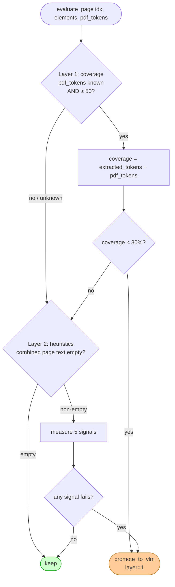
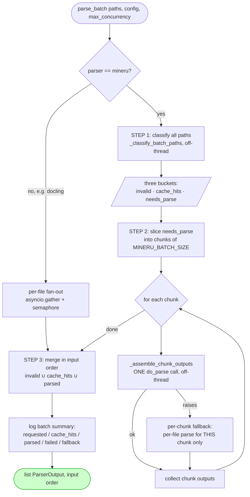

# Logic Flow — hybrid-doc-parser

This document explains **how the code thinks**: the control flow through the
library, from a single `parse()` call to batch inference, the quality gate, and
VLM enrichment. It complements [parse-pipeline.md](parse-pipeline.md) (which is
the exhaustive per-branch reference) by focusing on the *decision logic* and the
*module relationships*.

- **Entry points:** `parse()` and `parse_batch()` in
  [`parser.py`](../src/hybrid_doc_parser/parser.py)
- **Core invariant:** neither entry point raises — failures become
  `WarningRecord`s inside a valid `ParserOutput`.

---

## 1. Module map — who calls whom

---

## 2. Single-document flow — `parse()`

The happy path and every guard, in order. Each red terminal is a valid
`ParserOutput` carrying a warning — **not** an exception.

**Why two layers of try/except:** the engine-specific blocks preserve the precise
codes (`mineru_failed` / `docling_failed`); the outer block is a last-resort net
that guarantees the never-raise contract for anything unforeseen
(`mineru_error` / `docling_error`).

---

## 3. Quality gate logic — `evaluate_page()`

The gate decides, per page, whether the cheap engine output is good enough
(`keep`) or should be escalated for VLM review (`promote_to_vlm`). Two layers,
short-circuit on the first failure.

| Layer | Signal | Threshold | Catches |
|---|---|---|---|
| 1 | Coverage ratio | < 30% (PDF only, ≥ 50 text-layer tokens) | Engine missed most of the embedded text |
| 2 | Garbled token ratio | > 20% | Mixed letter+digit junk (`a1b`) |
| 2 | Mean word length | < 2.0 chars | OCR noise / fragments |
| 2 | Dictionary hit rate | < 50% | Few real words/numbers |
| 2 | Repeated char run | ≥ 7 | OCR smearing (`aaaaaaa`) |
| 2 | ASCII printable ratio | < 90% | Control/garbage characters |

Layer 1 is **PDF-only** (needs an embedded text layer; pypdfium2 counts tokens via
[`render.py`](../src/hybrid_doc_parser/render.py)). DOCX/HTML skip it. Layer 2 runs
for all input types. A blank page is a clean `keep`, never an escalation.

---

## 4. VLM enrichment logic — `_enrich_elements()`

Runs only when `config.enabled=True` **and** `config.parser="mineru"`. Each target
element is enriched independently; an error on one element is captured as a warning
and does not stop the others.

The VLM backend is selected by `make_vlm_client(config)` in
[`vlm_client.py`](../src/hybrid_doc_parser/vlm_client.py). To self-host the model
(MinerU 2.5 VL via vLLM), use `openai_compatible` and point `OPENAI_BASE_URL` at
the vLLM server — see
[SELF_HOSTING_JUSTIFICATION.md](SELF_HOSTING_JUSTIFICATION.md).

---

## 5. Batch flow — `parse_batch()`

The batch path exists to cut MinerU inference windows from `N` (one per file) to
`ceil(N / MINERU_BATCH_SIZE)` (one per chunk). This is the focus of the
`batch_process` work.

Key properties:

- **Cache hits and invalid paths never reach inference** — they are resolved in
  STEP 1 and merged back at the end.
- **Per-chunk isolation** — if one chunk's `do_parse` raises, only that chunk
  falls back to per-file `parse()`; other chunks are unaffected.
- **Concurrency knobs are separate:** `max_concurrency` governs the per-file
  fallback and the non-MinerU path; `MINERU_BATCH_SIZE` controls chunk size and
  `MINERU_MAX_INFLIGHT` bounds concurrent MinerU inference calls (multi-GPU). All
  blocking work (sha256, inference, token counting, enrichment) is offloaded with
  `asyncio.to_thread` so the event loop never stalls.
- **Output order always equals input order**, one `ParserOutput` per input path.

---

## 6. The never-raise contract, visualised

Every box that can fail funnels into a warning, never an exception:

Warning codes (full table in [parse-pipeline.md](parse-pipeline.md#warning-codes)):
`file_not_found`, `unsupported_type`, `mineru_failed`, `mineru_error`,
`docling_failed`, `docling_error`, `enrichment_error`, `enrichment_not_supported`,
`quality_gate_escalation`, `image_too_large`, `cache_write_error`, `render_failed`.

---

## See also

- [parse-pipeline.md](parse-pipeline.md) — exhaustive per-branch reference + full schema
- [pdf-routing.md](pdf-routing.md) — how PDFs are routed between backends
- [PACKAGES.md](PACKAGES.md) — dependency inventory
- [SELF_HOSTING_JUSTIFICATION.md](SELF_HOSTING_JUSTIFICATION.md) — why self-host MinerU 2.5 VL
