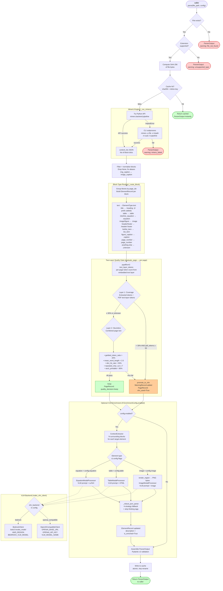

# hybrid-doc-parser: Parse Pipeline

## Overview Diagram



## Step-by-Step Reference

| Step | What happens | Module |
|------|-------------|--------|
| **1. Guard checks** | File must exist and have a supported extension (`.pdf`, `.png`, `.jpg`, etc.). Fails fast with a warning if not. | `parser.py` |
| **2. SHA-256** | Hash the raw file bytes — permanent document fingerprint used in the cache key and output. | `parser.py` |
| **3. Cache check** | Key = `sha256[:32] + "_" + mtime_ms`. If the file hasn't changed since last parse, return the cached `ParserOutput` instantly — MinerU never runs. | `cache.py` |
| **4. MinerU** | Tries the Python API (`mineru.backend.pipeline`) first. Falls back to CLI subprocess (`mineru -p … -m auto -b pipeline`). On CPU-only machines, `CUDA_VISIBLE_DEVICES=""` is set automatically. Produces a `content_list`: a flat list of block dicts with `type`, `text`, `bbox`, `page_idx`. | `parser.py → _run_mineru` |
| **5. Block routing** | Each block dict is mapped to a typed `ElementRecord`. `title` blocks get their heading level encoded as `#` prefix in the text. Bad/malformed blocks are silently skipped (non-fatal). | `parser.py → _route_block` |
| **6. Quality gate — Layer 1** | pypdfium2 counts tokens in the PDF's embedded text layer. If MinerU only extracted <30% of them, the page is marked `promote_to_vlm` — the page was likely scanned or poorly detected. | `quality_gate.py`, `render.py` |
| **7. Quality gate — Layer 2** | Five heuristic signals on the combined page text: garbled token ratio, mean word length, dictionary hit rate, repeated char runs, ASCII printable ratio. Any breach → `promote_to_vlm`. | `quality_gate.py` |
| **8. Enrichment (optional)** | If `EnrichmentConfig.enabled=True`, each image/table/equation element is enriched: surrounding context is extracted, a type-specific prompt is built, and the configured VLM is called. The response is parsed with a 4-strategy JSON fallback (handles markdown fences, partial JSON, reasoning model `<think>` tags). | `modal_processors.py`, `vlm_client.py`, `context.py` |
| **9. Assemble + cache** | All elements and page decisions are assembled into a validated Pydantic `ParserOutput`. Written to disk atomically (`.tmp` → rename). Returned to caller. | `parser.py`, `models.py`, `cache.py` |
| **10. Render (caller)** | Caller optionally calls `render_markdown(output)` to produce RAG-ready Markdown — drops furniture (headers/footers/page numbers), formats tables as GFM tables, wraps equations in `$$…$$`, emits enriched image descriptions as blockquotes. | `markdown.py` |

## Key Invariant

`parse()` **never raises**. Every failure path returns a valid `ParserOutput` with a `warnings` list
describing what went wrong. The caller always gets a structured result.

## Quality Gate Thresholds

| Signal | Threshold | Meaning |
|--------|-----------|---------|
| Coverage ratio (Layer 1) | < 30% | Too few MinerU blocks vs PDF text layer |
| Garbled token ratio | > 20% | Too many tokens with mixed letters+digits (e.g. `a1b`) |
| Mean word length | < 2.0 chars | Words are suspiciously short (OCR noise) |
| Dictionary hit rate | < 50% | Fewer than half the tokens are clean words or numbers |
| Repeated char run | ≥ 7 consecutive | e.g. `aaaaaaa` — OCR smearing artifact |
| ASCII printable ratio | < 90% | Too many non-printable or control characters |

## VLM Enrichment Prompts (per element type)

| Type | What is sent to VLM | Output |
|------|---------------------|--------|
| `image` | Base64 PNG crop of the region + surrounding text context | Plain-language description of the figure |
| `table` | HTML table body + surrounding text context | Semantic summary of rows, columns, key data |
| `equation` | LaTeX source + surrounding text context | Plain-language explanation of the formula |

## Data Schema

```
ParserOutput
├── file_path: str
├── file_sha256: str          # hex digest
├── schema_version: str       # "1.0"
├── page_count: int
├── pages: list[PageRecord]
│   ├── page_idx: int
│   ├── quality_decision: "keep" | "promote_to_vlm"
│   ├── element_count: int
│   └── vlm_used: bool
├── elements: list[ElementRecord]
│   ├── element_id: str       # "p{page}-{idx}"
│   ├── type: ElementType     # text/heading/table/image/equation/…
│   ├── text: str             # raw OCR or extracted text
│   ├── description: str      # VLM-generated (empty if not enriched)
│   ├── bbox: list[float]     # [x0, y0, x1, y1] in PDF points
│   ├── page_idx: int
│   └── is_enriched: bool
├── warnings: list[WarningRecord]
│   ├── page_idx: int | None
│   ├── code: str             # e.g. "quality_gate_escalation"
│   └── message: str
└── enrichment_config: EnrichmentConfig
    ├── enabled: bool
    ├── image / table / equation: bool
    ├── context_window: int   # surrounding blocks for VLM context
    ├── max_context_tokens: int
    └── vlm_backend: "openai_compatible" | "bedrock"
```

## Environment Variables

| Variable | Default | Purpose |
|----------|---------|---------|
| `MINERU_BACKEND` | `pipeline` | MinerU backend: `pipeline` or `vlm-auto-engine` |
| `PARSER_RENDER_DPI` | `144` | DPI for page/region rasterization |
| `PARSER_MAX_RENDER_MP` | `40.0` | Max megapixels per rendered page |
| `HYBRID_DOC_PARSER_CACHE_DIR` | `~/.cache/hybrid_doc_parser` | Cache directory |
| `OPENAI_BASE_URL` | — | Base URL for OpenAI-compatible VLM |
| `OPENAI_API_KEY` | — | API key for OpenAI-compatible VLM |
| `VLM_MODEL_NAME` | — | Model name for OpenAI-compatible VLM |
| `AWS_REGION` | `us-east-1` | AWS region for Bedrock |
| `BEDROCK_VLM_MODEL` | — | Model ID for Bedrock (e.g. `anthropic.claude-3-sonnet`) |
| `CUDA_VISIBLE_DEVICES` | (unset) | Set to `""` to force CPU on GPU-incompatible machines |
