# hybrid-doc-parser: Parse Pipeline

## Overview Diagram

```mermaid
flowchart TD
    A(["`**caller**
    parse(file_path, config)`"]) --> B{File exists?}
    B -- No --> ERR1([ParserOutput\nwarning: file_not_found])
    B -- Yes --> C{Extension supported?\n_accepted_extensions\nconfig}
    C -- No --> ERR2([ParserOutput\nwarning: unsupported_type])
    C -- Yes --> D[Compute SHA-256\nof file bytes]

    D --> E{Cache hit?\nsha256 + mtime key}
    E -- Hit --> CACHED([Return cached\nParserOutput instantly])
    E -- Miss --> DISPATCH

    DISPATCH{config.parser?} -- mineru --> MINERU
    DISPATCH -- docling --> DOCLING

    subgraph MINERU ["MinerU Engine  (_run_mineru)"]
        F[Try Python API\nmineru.backend.pipeline] -- ImportError --> G
        F -- API success --> H[content_list JSON\nlist of block dicts]
        G[CLI subprocess\nmineru -p file -o tmpdir\n-m auto -b pipeline] -- fail --> ERR3
        G -- success --> H
    end

    ERR3([ParserOutput\nwarning: mineru_failed])

    H --> I[Filter + normalise blocks\nDrop None, fix aliases\nimg_caption ↔ image_caption]
    I --> J[Group by page_idx\n_route_block per block]

    subgraph MinerURouting ["MinerU Block Routing  (_route_block)"]
        J --> J1["text → ElementType.text
        title → .heading  (# prefix added)
        table → .table
        interline_equation → .equation
        image/figure → .image
        header/footer → .header/.footer
        list/list_item → .list_item
        figure_caption → .caption
        page_number → .page_number
        anything else → .unknown"]
    end

    subgraph DOCLING ["Docling Engine  (_run_docling)"]
        DA[_get_docling_converter\nDouble-checked lock cache\nDocumentConverter] --> DB
        DB[converter.convert\nexport_to_dict] -- fail --> ERR4
        DB -- success --> DC[Walk body children\n_resolve_docling_ref\n$ref pointer resolution]
        DC --> DD[_route_docling_block\nper leaf block]
    end

    ERR4([ParserOutput\nwarning: docling_failed])

    subgraph DoclingRouting ["Docling Block Routing  (_route_docling_block)"]
        DD --> DD1["texts → label map:
        paragraph → .text
        section_header → .heading
        formula → .equation
        list_item → .list_item
        (others) → .unknown
        pictures → .image  (base64→bytes, 10 MB cap)
        tables → .table  (caption + JSON data)"]
    end

    J1 --> K
    DD1 --> K

    K{suffix == .pdf?} -- Yes --> K1[pypdfium2: text_layer_tokens\nper-page token count from\nembedded text layer]
    K -- No\nDOCX / HTML --> K2[Skip Layer 1\npass pdf_tokens=None\nlog debug]
    K1 --> L1
    K2 --> L2

    subgraph QualityGate ["Two-Layer Quality Gate  (evaluate_page — per page)"]
        L1{Layer 1: Coverage\nExtracted tokens ÷\nPDF text-layer tokens}
        L1 -- "< 30% AND pdf_tokens ≥ 50" --> PROMO[promote_to_vlm\nWarningRecord added\nPageRecord: vlm_used=True]
        L1 -- "≥ 30% or unknown" --> L2{Layer 2: Heuristics\nCombined page text}
        L2 --> L2A["• garbled_token_ratio > 20%\n• mean_word_length < 2.0\n• dict_hit_rate < 50%\n• repeated_char_run ≥ 7\n• ascii_printable < 90%"]
        L2A -- Any fail --> PROMO
        L2A -- All pass --> KEEP[keep\nPageRecord: quality_decision=keep]
    end

    PROMO --> M
    KEEP --> M

    subgraph Enrichment ["Optional VLM Enrichment  (if EnrichmentConfig.enabled)"]
        M{config.enabled?} -- No --> N
        M -- "Yes + parser=docling" --> MENOT[WarningRecord\nenrichment_not_supported\nskip enrichment\n⚠ not yet supported for Docling]
        MENOT --> N
        M -- "Yes + parser=mineru" --> M1[ContextExtractor\nN surrounding blocks\nfor each target element]
        M1 --> M2{"Element type\n& config flags"}
        M2 -- "image + config.image" --> M3[render_region → PNG bytes\nImageModalProcessor\nVLM prompt + image]
        M2 -- "table + config.table" --> M4[TableModalProcessor\nVLM prompt + HTML]
        M2 -- "equation + config.equation" --> M5[EquationModalProcessor\nVLM prompt + LaTeX]
        M3 --> M6["_robust_json_parse\n4-strategy fallback\n+ strip thinking tags"]
        M4 --> M6
        M5 --> M6
        M6 --> M7[ElementRecord updated\ndescription + is_enriched=True]
        M7 --> N
    end

    subgraph VLMBackend ["VLM Backend  (make_vlm_client)"]
        M3 & M4 & M5 -.-> VB{"vlm_backend\nin config"}
        VB -- openai_compatible --> VB1[OpenAICompatibleClient\nOPENAI_BASE_URL\nOPENAI_API_KEY\nVLM_MODEL_NAME]
        VB -- bedrock --> VB2[BedrockClient\nboto3 invoke_model\nAWS_REGION\nBEDROCK_VLM_MODEL]
    end

    N[Assemble ParserOutput\nPydantic v2 validation] --> O[Write to cache\natomic .tmp rename]
    O --> P([Return ParserOutput\nto caller])

    style ERR1 fill:#fcc,stroke:#c00
    style ERR2 fill:#fcc,stroke:#c00
    style ERR3 fill:#fcc,stroke:#c00
    style ERR4 fill:#fcc,stroke:#c00
    style CACHED fill:#cfc,stroke:#090
    style P fill:#cfc,stroke:#090
    style PROMO fill:#fc9,stroke:#a60
    style KEEP fill:#cfc,stroke:#090
    style MENOT fill:#fc9,stroke:#a60
```



## Step-by-Step Reference

| Step | What happens | Module |
|------|-------------|--------|
| **1. Guard checks** | File must exist and have a supported extension. Supported extensions depend on `config.parser`: MinerU accepts `.pdf`, `.png`, `.jpg`, `.jpeg`, `.tif`, `.tiff`, `.webp`; Docling additionally accepts `.docx`, `.doc`, `.html`, `.htm`, `.xhtml`. Fails fast with a warning if not. | `parser.py` |
| **2. SHA-256** | Hash the raw file bytes — permanent document fingerprint used in the cache key and output. | `parser.py` |
| **3. Cache check** | Key = `sha256[:32] + "_" + mtime_ms`. If the file hasn't changed since last parse, return the cached `ParserOutput` instantly — no engine runs. | `cache.py` |
| **4a. MinerU** (`parser="mineru"`) | Tries the Python API (`mineru.backend.pipeline`) first. Falls back to CLI subprocess (`mineru -p … -m auto -b pipeline`). Produces a `content_list`: a flat list of block dicts with `type`, `text`, `bbox`, `page_idx`. | `parser.py → _run_mineru` |
| **4b. Docling** (`parser="docling"`) | Obtains a cached `DocumentConverter` (double-checked lock, keyed on `table_mode + do_ocr + do_table_structure`). Calls `converter.convert()` then `export_to_dict()`. Walks `body["children"]` recursively via `_resolve_docling_ref` (`$ref` pointer resolution). Routes each leaf block via `_route_docling_block`. Supports PDF, DOCX, and HTML. | `parser.py → _run_docling` |
| **5. Block routing** | MinerU blocks: `_route_block` maps `type` strings to `ElementType`; `title` blocks get `#` prefix. Docling blocks: `_route_docling_block` maps label strings; `pictures` are decoded from base64 (10 MB cap); `tables` serialise caption + cell data as JSON text. Bad/malformed blocks are skipped non-fatally. | `parser.py` |
| **6. Quality gate — Layer 1** | For `.pdf` files only: pypdfium2 counts tokens in the embedded text layer. If the engine extracted <30% of them, the page is marked `promote_to_vlm`. Skipped entirely for DOCX and HTML inputs (no PDF text layer). | `quality_gate.py`, `render.py` |
| **7. Quality gate — Layer 2** | Five heuristic signals on the combined page text: garbled token ratio, mean word length, dictionary hit rate, repeated char runs, ASCII printable ratio. Any breach → `promote_to_vlm`. Runs for all input types. | `quality_gate.py` |
| **8. Enrichment (optional)** | Only active when `config.enabled=True` **and** `config.parser="mineru"`. Each image/table/equation element is enriched: surrounding context is extracted, a type-specific prompt is built, and the configured VLM is called. When `config.parser="docling"`, enrichment is not yet supported — a `WarningRecord(code="enrichment_not_supported")` is emitted instead. | `modal_processors.py`, `vlm_client.py`, `context.py` |
| **9. Assemble + cache** | All elements and page decisions are assembled into a validated Pydantic `ParserOutput`. Written to disk atomically (`.tmp` → rename). Returned to caller. | `parser.py`, `models.py`, `cache.py` |
| **10. Render (caller)** | Caller optionally calls `render_markdown(output)` to produce RAG-ready Markdown — drops furniture (headers/footers/page numbers), formats tables as GFM tables, wraps equations in `$$…$$`, emits enriched image descriptions as blockquotes. | `markdown.py` |

## Key Invariant

`parse()` **never raises**. Every failure path returns a valid `ParserOutput` with a `warnings` list
describing what went wrong. The caller always gets a structured result.

## Quality Gate Thresholds

| Signal | Threshold | Meaning |
|--------|-----------|---------|
| Coverage ratio (Layer 1) | < 30% | Too few engine blocks vs PDF text layer — PDF only |
| Garbled token ratio | > 20% | Too many tokens with mixed letters+digits (e.g. `a1b`) |
| Mean word length | < 2.0 chars | Words are suspiciously short (OCR noise) |
| Dictionary hit rate | < 50% | Fewer than half the tokens are clean words or numbers |
| Repeated char run | ≥ 7 consecutive | e.g. `aaaaaaa` — OCR smearing artifact |
| ASCII printable ratio | < 90% | Too many non-printable or control characters |

## VLM Enrichment Prompts (per element type)

> Enrichment is only active when `config.parser="mineru"`. Docling enrichment is not yet supported.

| Type | What is sent to VLM | Output |
|------|---------------------|--------|
| `image` | Base64 PNG crop of the region + surrounding text context | Plain-language description of the figure |
| `table` | HTML table body + surrounding text context | Semantic summary of rows, columns, key data |
| `equation` | LaTeX source + surrounding text context | Plain-language explanation of the formula |

## Data Schema

```
ParserOutput
├── file_path: str
├── file_sha256: str          # hex digest
├── schema_version: str       # "1.0"
├── page_count: int
├── pages: list[PageRecord]
│   ├── page_idx: int
│   ├── quality_decision: "keep" | "promote_to_vlm"
│   ├── element_count: int
│   └── vlm_used: bool
├── elements: list[ElementRecord]
│   ├── element_id: str       # UUID v5 keyed on sha256+page+idx
│   ├── type: ElementType     # text/heading/table/image/equation/…
│   ├── text: str             # raw OCR or extracted text
│   ├── description: str      # VLM-generated (empty if not enriched)
│   ├── bbox: list[float]     # [x0, y0, x1, y1] in PDF points
│   │                         # Docling: normalised from {l,b,r,t} BOTTOMLEFT origin
│   ├── image_bytes: bytes | None  # Docling pictures only; None if > 10 MB
│   ├── page_idx: int
│   └── is_enriched: bool
├── warnings: list[WarningRecord]
│   ├── page_idx: int | None
│   ├── code: str             # see Warning Codes table below
│   └── message: str
└── enrichment_config: EnrichmentConfig
    ├── parser: "mineru" | "docling"      # backend selector
    ├── enabled: bool
    ├── image / table / equation: bool
    ├── context_window: int               # surrounding blocks for VLM context
    ├── max_context_tokens: int
    ├── vlm_backend: "openai_compatible" | "bedrock"
    ├── do_ocr: bool                      # Docling: enable OCR (default True)
    ├── table_mode: "fast" | "accurate"   # Docling: TableFormer mode
    ├── do_table_structure: bool          # Docling: run table structure (expensive)
    └── docling_artifacts_path: str | None  # Docling: custom model weights path
```

## Warning Codes

| Code | Backend | Meaning |
|------|---------|---------|
| `file_not_found` | both | Input file does not exist |
| `unsupported_type` | both | File extension not accepted by the selected parser |
| `mineru_failed` | mineru | Both Python API and CLI fallback raised an exception |
| `mineru_error` | mineru | Unhandled outer exception during MinerU parse |
| `docling_failed` | docling | `DocumentConverter.convert()` raised an exception |
| `docling_error` | docling | Unhandled outer exception during Docling parse |
| `quality_gate_escalation` | both | Page escalated to `promote_to_vlm` by quality gate |
| `enrichment_error` | mineru | VLM enrichment call raised an exception |
| `enrichment_not_supported` | docling | `config.enabled=True` but Docling enrichment is not yet implemented |
| `image_too_large` | docling | Picture block base64 decoded to > 10 MB; `image_bytes` set to `None` |

## Environment Variables

| Variable | Default | Purpose |
|----------|---------|---------|
| `MINERU_BACKEND` | `pipeline` | MinerU backend: `pipeline` or `vlm-auto-engine` |
| `PARSER_RENDER_DPI` | `144` | DPI for page/region rasterization |
| `PARSER_MAX_RENDER_MP` | `40.0` | Max megapixels per rendered page |
| `HYBRID_DOC_PARSER_CACHE_DIR` | `~/.cache/hybrid_doc_parser` | Cache directory |
| `OPENAI_BASE_URL` | — | Base URL for OpenAI-compatible VLM |
| `OPENAI_API_KEY` | — | API key for OpenAI-compatible VLM |
| `VLM_MODEL_NAME` | — | Model name for OpenAI-compatible VLM |
| `AWS_REGION` | `ap-southeast-2` | AWS region for Bedrock |
| `BEDROCK_VLM_MODEL` | — | Model ID for Bedrock (e.g. `anthropic.claude-3-sonnet`) |
| `CUDA_VISIBLE_DEVICES` | (unset) | Set to `""` to force CPU on GPU-incompatible machines (affects both MinerU and Docling) |
