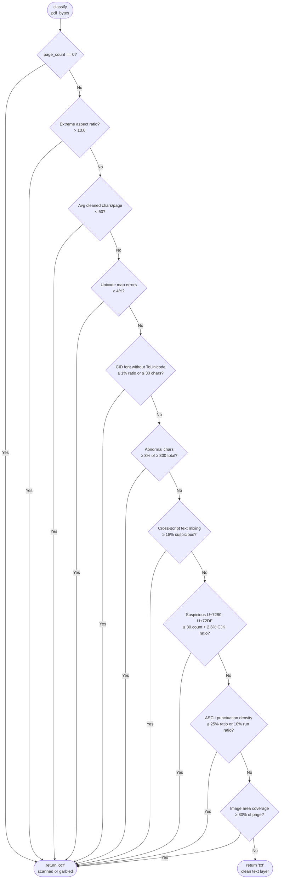
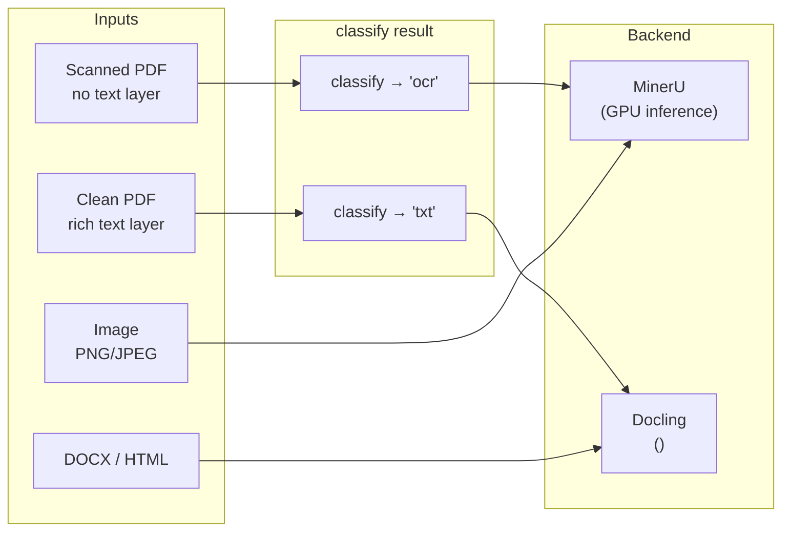

# PDF Backend Routing: MinerU vs Docling

## Background

The library exposes two parsing backends:

| Backend | Strength | Cost |
|---|---|---|
| **MinerU** | Handles scanned PDFs, garbled text layers, complex layouts via vision models | Heavy — GPU inference per page |
| **Docling** | Fast, cheap extraction from clean text-layer PDFs and Office/HTML formats | Light — no vision model needed |

The colleague's suggestion is to use MinerU's own `classify()` heuristic to auto-select the backend instead of requiring the caller to pick one explicitly.

---

## Current Architecture (Explicit Routing)

`EnrichmentConfig.parser` is a hard literal — the caller always decides:

```python
config = EnrichmentConfig(parser="mineru")   # always heavy
config = EnrichmentConfig(parser="docling")  # always cheap
```

```mermaid
flowchart TD
    A(["`parse(file_path, config)`"]) --> B{config.parser?}
    B -- '"mineru"' --> M[_run_mineru\ndo_parse / GPU inference]
    B -- '"docling"' --> D[_run_docling\nDocumentConverter]
    M --> OUT([ParserOutput])
    D --> OUT
```

There is no automatic selection — callers who always use `"mineru"` pay vision-model cost even on clean, text-rich PDFs.

---

## MinerU's classify() Heuristic

Located in `references/mineru/mineru/utils/pdf_classify.py:89`.

The function samples up to **10 pages** and runs 10 sequential checks. It returns `"ocr"` on the **first failure**, `"txt"` only if all checks pass.



### What each check catches

| Check | Signal |
|---|---|
| Extreme aspect ratio | Panoramic scans or stitched page images |
| Low char count | Image-only pages with no embedded text |
| Unicode map errors | Fonts without proper ToUnicode tables |
| CID font without ToUnicode | Identity-H/Identity-V CID fonts (common in scanned Asian docs) |
| Abnormal chars | Control chars, replacement chars, private-use area leakage |
| Cross-script mixing | Garbled encoding emitting Cyrillic/Arabic/etc. alongside CJK |
| Suspicious U+72xx | A specific garbled CJK encoding artefact range |
| ASCII punctuation density | Mojibake producing long runs of punctuation |
| High image coverage | Pages that are purely embedded images |

---

## Proposed Auto-Routing

Add `parser="auto"` to `EnrichmentConfig`. On PDF inputs, call `classify()` before dispatching. Non-PDF inputs fall back to the extension-based rule already implied by `_SUPPORTED_EXTENSIONS` vs `_DOCLING_EXTENSIONS`.

```mermaid
flowchart TD
    A(["`parse(file_path, config)`"]) --> B{config.parser?}

    B -- '"mineru"' --> M
    B -- '"docling"' --> D
    B -- '"auto"' --> EXT{Is .pdf?}

    EXT -- No\nimages → mineru\ndocx/html → docling --> EXTROUTE{suffix in\n_SUPPORTED_EXTENSIONS?}
    EXTROUTE -- Yes --> M
    EXTROUTE -- No --> D

    EXT -- Yes --> CL["classify(pdf_bytes)\nfrom mineru.utils.pdf_classify"]
    CL --> CR{result?}
    CR -- '"ocr"\nscanned / garbled' --> M
    CR -- '"txt"\nclean text layer' --> D
    CL -. classify() raises .-> FALLBACK["log warning\nfallback → 'mineru'"]
    FALLBACK --> M

    M[_run_mineru\ndo_parse / GPU inference] --> OUT([ParserOutput])
    D[_run_docling\nDocumentConverter] --> OUT
```

### Where it sits in the code

The resolution happens at `parser.py:1563`, just before the existing `if config.parser == "docling":` branch:

```python
# Resolve effective backend for this file.
effective_parser = config.parser
if effective_parser == "auto" and file_path.suffix.lower() == ".pdf":
    try:
        from mineru.utils.pdf_classify import classify  # noqa: PLC0415
        pdf_class = classify(file_path.read_bytes())
        effective_parser = "mineru" if pdf_class == "ocr" else "docling"
        logger.debug(
            "[parser] auto-classify {} -> {} ({})",
            file_path.name, effective_parser, pdf_class,
        )
    except Exception as exc:
        logger.warning("[parser] classify() failed, falling back to mineru: {}", exc)
        effective_parser = "mineru"
elif effective_parser == "auto":
    effective_parser = (
        "mineru" if file_path.suffix.lower() in _SUPPORTED_EXTENSIONS else "docling"
    )

# Existing dispatch — replace config.parser with effective_parser.
if effective_parser == "docling":
    ...
else:
    ...
```

The model field change in `models.py`:

```python
parser: Literal["mineru", "docling", "auto"] = "mineru"
```

---

## Cost Profile



| Scenario | Before auto | After auto |
|---|---|---|
| Scanned PDF | MinerU (correct) | MinerU (same) |
| Clean text PDF | MinerU (wasteful) | Docling (cheaper) |
| DOCX / HTML | Docling only | Docling (same) |
| Image | MinerU (correct) | MinerU (same) |

---

## Constraints and Trade-offs

- `classify()` reads up to 10 pages via `pypdfium2` — this adds ~50–200 ms per PDF but avoids GPU inference for clean documents.
- On `classify()` failure the safe fallback is MinerU (never silently drops content).
- The existing `parse_batch()` fast path (`config.parser != "mineru"` check at `parser.py:1684`) must be updated to treat `"auto"` as a per-file decision rather than a single-backend batch — or the batch path must resolve `effective_parser` per file before chunking.
- `classify()` uses `pypdfium2` which is guarded by `_PDFIUM_LOCK` elsewhere in this codebase; the classify call should acquire the same lock to remain thread-safe under `parse_batch()`.
